<picture>
  <source media="(prefers-color-scheme: dark)" srcset="./dark.svg">
  <source media="(prefers-color-scheme: light)" srcset="./light.svg">
  
</picture>

### Hi, I'm Asad

Senior Frontend Developer building user interfaces for AI-powered products. I work mobile-first in Angular and TypeScript and own the frontend layer of AI-native features: real-time streaming of agent output, conversational and voice interfaces, and data-driven workflow screens.

Currently **Senior Frontend Developer at Flow9**, building the interface of an AI-native CRM and outreach platform.

## Focus

- **AI-powered interfaces:** real-time streaming UIs for agent execution, chat and conversational surfaces, voice-enabled experiences, natural-language command surfaces.
- **Frontend architecture:** reusable component libraries and patterns that keep a product consistent as new features ship.
- **Mobile-first delivery:** responsive, accessible, performance-minded screens across mobile, tablet and desktop.
- **Agentic systems:** agent orchestration, tool and function calling, structured outputs, prompt engineering, guardrails and execution controls.

## Experience

| Role | Company | Period |
| --- | --- | --- |
| Senior Frontend Developer | Flow9 · Remote | 07/2025 – present |
| Senior UI Engineer | Odea Integrations · Remote | 01/2025 – 07/2025 |
| Frontend Developer | SeeThruTec · Lahore | 07/2023 – 12/2024 |
| Frontend Developer | Icommunix · Lahore | 05/2021 – 07/2023 |
| Frontend Developer | Freelance | 02/2020 – 05/2021 |
| Frontend Developer | WAISOL · Lahore | 02/2017 – 08/2019 |

## Featured project

**JARVIS: agentic AI software-engineering platform** · *independent project*

- Voice-first interface that turns natural-language and voice commands into executed software-engineering work, with conversational context and interruption handling.
- Real-time frontend for agent execution: live streaming of coding, testing and review agents working through multi-step tasks.
- Agent workflow: Jira-driven task entry, specialised coder, tester and reviewer agents, and Git lifecycle automation through to a prepared pull request.

## Stack

| | |
| --- | --- |
| **Frontend** | Angular · TypeScript · JavaScript (ES6+) · HTML5 · CSS3 · SCSS · Tailwind CSS · Bootstrap · PrimeNG · Material UI |
| **AI interfaces** | Streaming agent UIs · chat and conversational UIs · voice experiences · natural-language command surfaces |
| **Agentic systems** | Agent orchestration · tool and function calling · structured outputs · prompt engineering · guardrails |
| **Engineering** | REST APIs · real-time streaming · Git and GitHub · code review · testing · Agile |

## Education

Bachelor of Science in Computer Science, Lahore Garrison University (2016 – 2020)

## Connect

[LinkedIn](https://www.linkedin.com/in/asad-hanif-994b051a) · [Email](mailto:asadalihaneef@hotmail.com) · [GitHub](https://github.com/Asadali1010)
